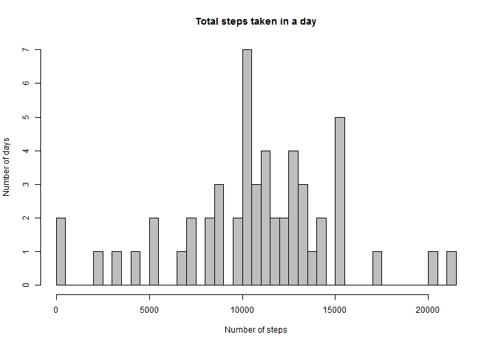
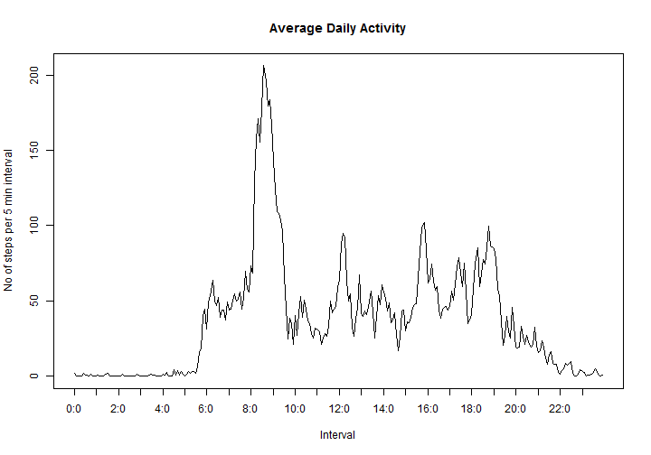
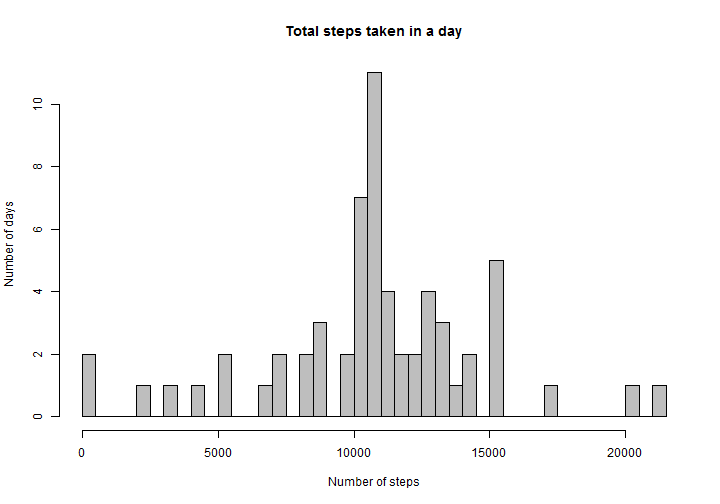
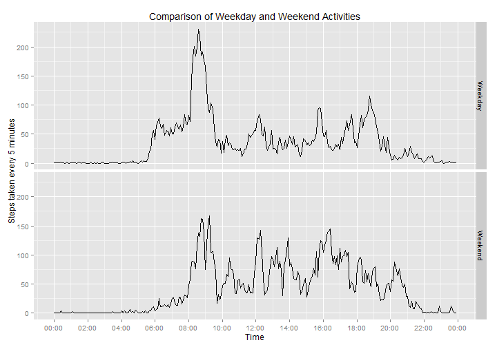

## Loading and preprocessing the data


```r
raw_data <- read.csv('activity.csv')
```

```
## Warning in file(file, "rt"): cannot open file 'activity.csv': No such file
## or directory
```

```
## Error in file(file, "rt"): cannot open the connection
```

```r
# Remove those rows that have na in 'steps' column
data<-raw_data[!is.na(raw_data[,1]),]
data$date<-as.Date(data$date,"%Y-%m-%d")
```

## What is mean total number of steps taken per day?


```r
library(ggplot2, quietly=TRUE, warn.conflicts=FALSE)
total_steps<-aggregate(steps ~ date, data, sum)
hist(total_steps$steps, breaks=50, main='Total steps taken in a day', xlab='Number of steps', ylab='Number of days', col='Grey')
```

 

```r
mean_total_steps<-mean(total_steps$steps, trim=1)
median_total_steps<-median(total_steps$steps)
```

#### The mean total number of steps taken per day is 10765 steps.

#### The median total number of steps taken per day is 10765 steps.

## What is the average daily activity pattern?


```r
avg_steps<-aggregate(steps ~ interval, data, mean)

#
# Interval is the time of day in hour-minute format
# Use interval to create a datetime variable and labels for the graph
#
dt_label<-function(x) {
  #
  # Input a number abcd
  # Output a character string ab:cd
  #
  paste(as.character(x%/%100), as.character(x%%100), sep=':')
}

dt<-strptime(dt_label(avg_steps$interval), "%H:%M")
labels<-dt_label(avg_steps$interval)
plot(dt, avg_steps$steps, type="l", main="Average Daily Activity", xlab="Interval", ylab="No of steps per 5 min interval", xaxt='n')
axis.POSIXct(1, at=dt[seq(1,288,12)], labels=labels[seq(1,288,12)])
```

 

```r
max_step_interval<-avg_steps$interval[avg_steps$steps==max(avg_steps$steps)]
max_step_interval<-dt_label(max_step_interval)
```

#### The maximum average number of steps occur at 8:35 hour.


## Imputing missing values


```r
no_missing_values<-sum(is.na(raw_data))
```

#### There are 2304 missing values in the dataset.


```r
imp<-function(x){
  #
  # Function to replace na entries in 'steps' column to the mean value of the same interval
  #
  m <- aggregate(steps ~interval, x, mean)
  for (i in seq(1,nrow(x))) {
    if (is.na(x$steps[i])) {
      # find corresponding interval in mean matrix
      row<-(m$interval==x$interval[i])
      # assign mean value to na entry
      x$steps[i] <- m$steps[row]
    }
  }
  # return the imputed dataset
  x
}

imp_dataset<-imp(raw_data)
imp_total_by_day<-aggregate(steps ~ date, imp_dataset, sum)
hist(imp_total_by_day$steps, breaks=50, main='Total steps taken in a day', xlab='Number of steps', ylab='Number of days', col='Grey')
```

 

```r
imp_mean_total_by_day<-mean(imp_total_by_day$steps, trim=1)
imp_median_total_by_day<-median(imp_total_by_day$steps)
```

#### The new mean and median values are 10766 and 10766 respectively.

#### Imputing missing values with the mean values changes the mean and median values.


## Are there differences in activity patterns between weekdays and weekends?


```r
wkday<-function(x){
  x[,'wkday_wkend']<-weekdays(as.Date(x$date))
  for (i in seq(1,nrow(x))) {
    if ((x$wkday_wkend[i]=="Saturday")||(x$wkday_wkend[i]=="Sunday"))
      x$wkday_wkend[i]<-"Weekend"
    else
      x$wkday_wkend[i]<-"Weekday"
  }
  x
}

#add a column of factors classifying each day as 'weekday'or 'weekend'
imp_data<-wkday(imp_dataset)
imp_data$wkday_wkend<-as.factor(imp_data$wkday_wkend)

mean_steps_by_interval_n_weekday<-aggregate(steps ~ interval + wkday_wkend, imp_data, mean)
mean_steps_by_interval_n_weekday$time<-as.POSIXct(dt, format='%Y-%m-%d %H:%M')

library(scales)
ggplot(mean_steps_by_interval_n_weekday, aes(x=time, y=steps))+geom_line()+facet_grid(wkday_wkend ~ .)+scale_x_datetime( breaks=("2 hour"), labels=date_format("%H:%M")) + xlab("Time") + ylab("Steps taken every 5 minutes") + ggtitle("Comparison of Weekday and Weekend Activities")
```

 
